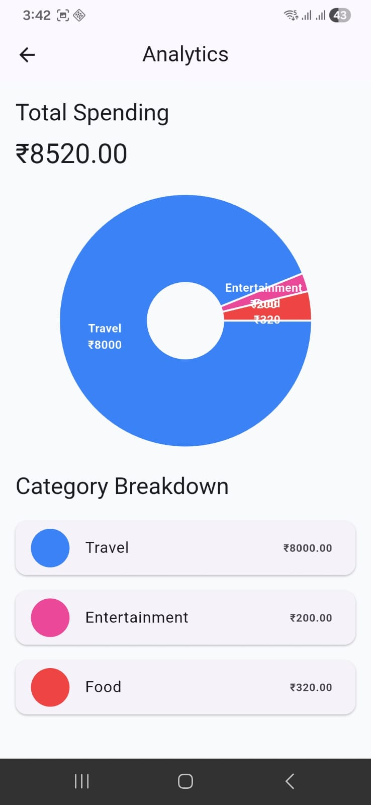

# Daily Expenses - Expense Management Application

A modern Flutter Expense Management Application built using GetX and SQFLite.

This application helps users manage daily expenses with features like:

- Add Expense
- Edit Expense
- Delete Expense
- Search Expenses
- Category Filtering
- Analytics Dashboard
- Dark / Light Theme
- Local Database Storage
- Responsive UI

---

# Tech Stack

| Technology | Usage                      |
| ---------- | -------------------------- |
| Flutter    | UI Framework               |
| GetX       | State Management + Routing |
| SQFLite    | Local Database             |
| fl_chart   | Analytics Pie Chart        |
| Lottie     | Splash Animation           |
| intl       | Date Formatting            |

---

# Features

## Expense Management

- Add new expenses
- Edit existing expenses
- Delete expenses
- Store expenses locally using SQLite

---

## Expense Fields

Each expense contains:

- Title
- Amount
- Category
- Date

---

## Search & Filtering

- Search expenses by title
- Filter expenses category-wise

---

## Analytics Dashboard

- Pie chart visualization
- Category-wise expense breakdown
- Total spending calculation

---

## Theme Support

- Light Mode
- Dark Mode
- Dynamic theme switching using GetX

---

## Responsive UI

- Clean layout
- Reusable widgets
- Proper spacing and structure

---

# Project Architecture

The project follows a clean modular architecture.

```bash
lib/
│
├── core/
│   ├── constants/
│   ├── utils/
│   ├── widgets/
│   └── theme/
│
├── data/
│   ├── models/
│   ├── database/
│   └── repositories/
│
├── modules/
│   ├── splash/
│   ├── home/
│   ├── add/
│   └── analytics/
│
├── routes/
├── services/
├── app.dart
└── main.dart
```

# Screenshots

## Home Screen


## Analytics Screen


